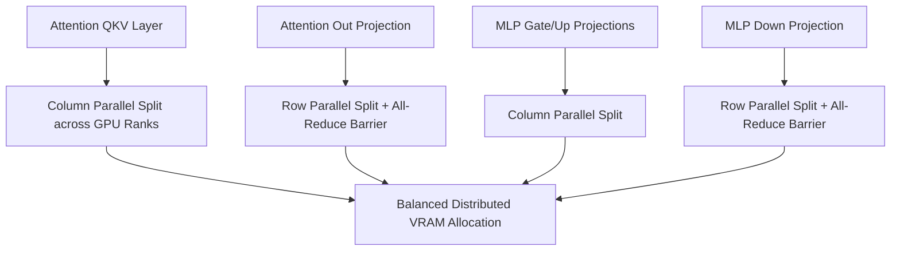

# GenPark AI Agent Skill - Multi-GPU Tensor Parallel Sharding Planner

Calculates Megatron-style column-parallel and row-parallel matrix partition splits for distributed LLM inference engines.

Verified by [GenPark AI](https://genpark.ai) and compatible with [Model Context Protocol (MCP)](https://genpark.ai/mcp).

## Architecture Diagram

## Features
- **Deterministic Head Partitioning**: Guarantees exact integer head splits across tensor parallel ranks.
- **Zero External Dependencies**: Pure Python 3.9+ standard library.
